# AVERLAND ADVENTURES
___

This is a simple text-based "Choose Your Own Adventure" styled RPG game.

# Five UX Planes

## Strategy

Users will want clean presentation of text. 
Users will want unambiguous options presented to them. 
Users will want to be able to loop through each area of the game in a logical way. 
Users will want a progression system. 
Users will want equipment for their character. 
Users will want to be able to earn gold for more equipment. 
Users will want to be able to defeat enemies. 
Users will want to be able to clear quests. 
Users will want to be able to restart if they fail. 
Users will want the option to quit once they are done. 
Users will want replayability in the game. 

## Scope

The game should cleanly present all text in a readable manner. 
The text should remain on screen until the user makes a choice. 
The text should clear after the user makes a choice so as to cleanly present the next options. 
The game should adequately handle and display any errors in user input so the user can understand what to press. 
The game should have multiple functions and classes to handle the progression through the game. 
The game should naturally loop between those areas and carry variables across them. 
The variables should be able to be modified in each area of code so as to allow player progression. 
The game should have randomised elements for replayability. 
The game should have the potential to expand to more areas for exploration. 
The game should have the potential for more varied encounters and battles. 

## Structure

In order to fulfill the users wants from the Strategy plane and the plans from the Scope plane I created several flowcharts to understand how the game would flow. 

A flowchart was drawn up before any code was written to better understand how each function would lead to one another to create the gameplay loop. 
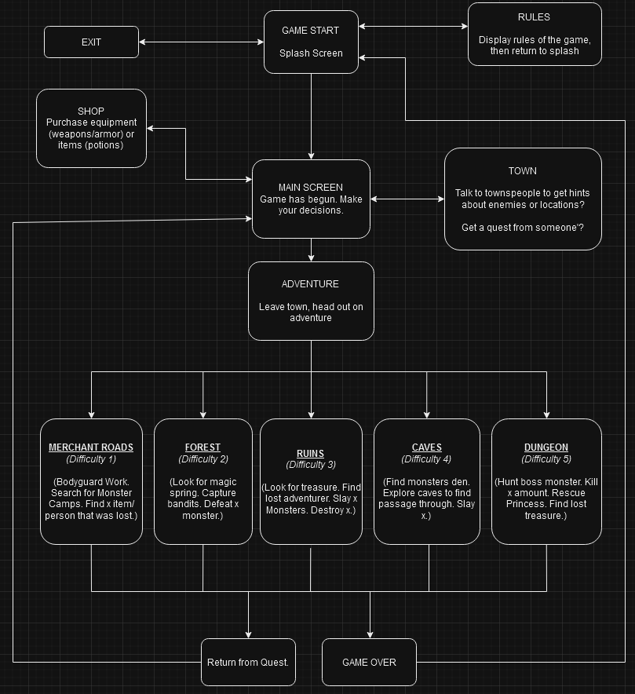

A flowchart was drawn up before any code was written to better map out the road for when it came time to code it. 

A flowchart was drawn up before any code was written to better map out the forest for when it came time to code it. 

### Main Scripts

#### run.py
This script is primarily used just to call the beginning function "splash_screen()" from the game_intro.py script. 

#### Helper Scripts

##### game_slow_functions
This script contains several functions to satisfy the need to gradually print out text to the user for 
clean presentation as well as offer the option for a delayed screen clear to allow for text comprehension 
before the terminal clears. 

##### game_inside_travels
This is primarily a helper script used by the game_hubworld.py script to move to the game_road.py or game_forest.py scripts. 
Cyclical import errors would occur without the functions within these scripts being separated. 

##### game_outside_travels
This is primarily a helper script used by the game_road.py and game_forest.py scripts to move to the game_hubworld.py or game_forest.py scripts. 
Cyclical import errors would occur without the functions within these scripts being separated. 

### World Scripts

#### game_intro
This script is called at the beginning of the game. 
It is used to present the user with the option to read the rules of the game. 
It also prompts the user to quit the game if they wish. 
It also allows the user to start the game. 
Once the game is started the user is prompted to enter their name. 
This name is then used to create a new instance of a Player Character from the game_characters.py script. 
The game will then move to the game_hubworld script. 

#### game_hubworld
This script is the center of the game loop once it has started. 
The player starts in the town. 
From here the player has several options. 
The player can end the game. 
The player can check their status and equip new items. 
The player can use the shop, which loops back to the town once the player leaves. 
In the shop the player can purchase or sell equipment. 
The player can go to the tavern, which loops back to the town once the player leaves.. 
In the tavern the player can accept quests from a board or from locals. 
The player can report successful quests and be rewarded for their efforts. 
The player can go to to the town gates to depart on an adventure. 
The player can choose to go to the road, the forest, or remain in town. 
Choosing the road moves the game to the game_road script. 
Choosing the road moves the game to the game_forest script. 

#### game_road
This script holds all functions for the road as the player progresses through it. 
The script begins at the start of the road, with the player having the option to check their
status or return to town if they feel unprepared. 
The road consists of several functions that act as sub-rooms that all lead to one another sequentially. 
Certain rooms have side paths the player can discover that they can travel. 
Certain rooms have randomised encounters with Enemies which initiate the game_battle.py script before looping back
to where the player was before the encounter. 
The last sub-room of the script gives the player the option to return to the game_hubworld.py which fully heals them. 

#### game_forest
This script holds all functions for the forest as the player progresses through it. 
The script begins at the start of the forest, with the player having the option to check their
status or return to town if they feel unprepared. 
The road consists of multiple functions that act as sub-rooms that lead to one another,
folloing the map laid out in the forest flowchart. 
Certain rooms have events or secrets that the player can discover. 
Certain rooms have randomised encounters with Enemies which initiate the game_battle.py script before looping back
to where the player was before the encounter. 
The last sub-room of the script gives the player the option to return to the game_hubworld.py which fully heals them. 

### Other Scripts

#### game_characters
This script holds the Character Class and the Player and Enemy subclasses. 
All other scripts access this script to use the variables stored within it and manipulate the Player class to allow for progression. 
The Character Class holds standard variables for character creation, as well as some methods used by both Player and Enemy for battles. 
Character methods allow Player and Enemy to attack one another reduce health and check health to see if either has been defeated. 
The Enemy class has additional variables and methods to reward gold and experience when defeated, allowing for progression. 
The Player class is the most fleshed out with additional variables and methods for player progression. 
The Player class allows the storing of items in an inventory. 
The Player class allows for the tracking of quests accepted and the status of those quests. 
The Player class allows for the display of a player's stats, inventory, quests, and options for equipping items. 
The Player class can level up, increasing stats and progressing, once enough enemies have been defeated. 
The Player class allows the player to heal during battles. 
The Player class has an additional method to block Enemy attacks, doubling defence with a chance to strike a critical hit afterwards. 

#### game_battles
This script is called whenever the player encounter a random or forced enemy. 
An enemy will either successfully ambus and harm the player, or the player will block it as the combat starts. 
The player will then be prompted to Attack, Defend, or Use an Item. 
Attacking will reduce the Enemy health. 
Defending will reduce damage taken by the enemy attack, and has a random chance to allow for a critical hit to follow. 
Using an Item allows the player to drink a potion to restore their health. 
The Enemy will always attack after the player's action.
The battle ends when either the Enemy or the Player lose all health. 
If the Enemy is defeated the player is returned to where they were prior, with added gold and experience for their victory. 
If the Player is defeated the game_over function runs and the game ends. 

## Skeleton

As the app works entirely through the python terminal and requires no external visuals such as HTML, or CSS code, there is no need to determine a wireframe for the presentation. 
As long as the app follows the strutcure laid out in the flow charts and doesn't extend beyond 80 character columns and 24 character rows without becoming obtrusive the app should work perfectly. 

## Surface

I wanted everything on the app to be presented cleanly.
I made sure that no line of text extended beyond 80 characters to prevent words from being slice when wrapped to the following row.
I made sure that any lines that were long used new-line breaks to force a wrap before any words would be sliced.

# Features

## Game
The game begins by prompting the user to start, read the rules, or exit the game. 
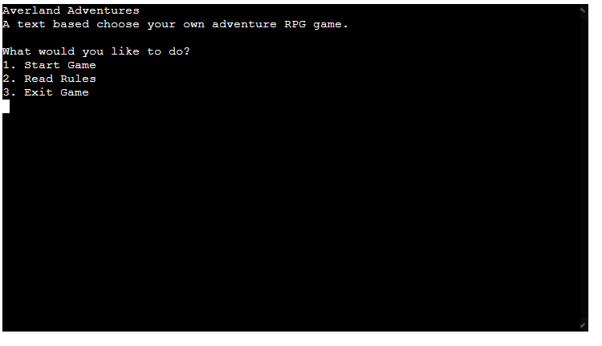

### Intro
Selecting to start the game prompts the user to enter a name for their adventurer, and prints out several stats about them before proceeding to the hubworld. 
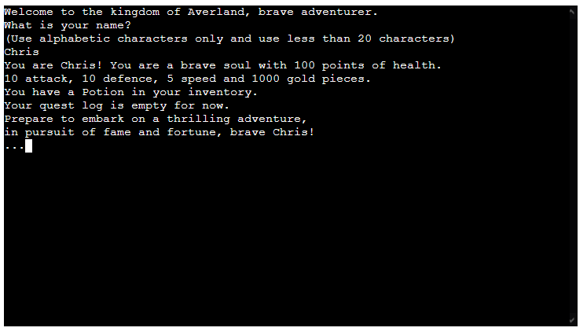

### Rules
Selecting to read the rules simply tells the user how the game operates, informing them that the game will only function if the on screen prompts are followed. 
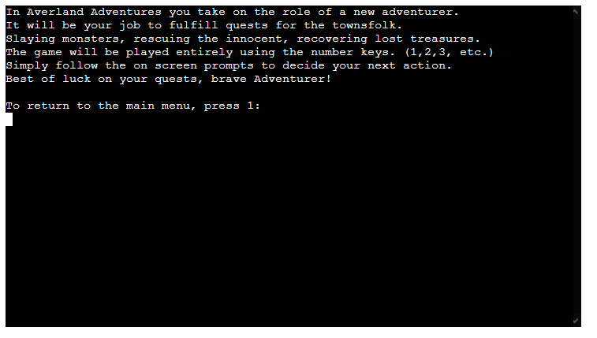

## Hubworld
The game begins with you in the centre of a town, with several options. The shop, the tavern for a quest, to adventure, to check your status, or to quit the game. 
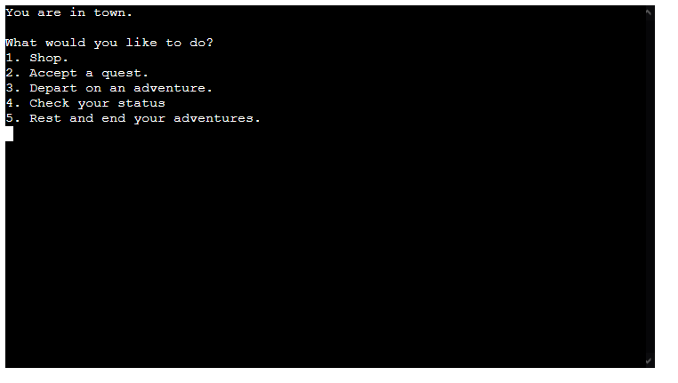

### Status
This simply tells the user their current status. Level, attack, defense, speed, gold, inventory, equipped items, and quest flags. It will also prompt the user if they wish to change their equipment. 
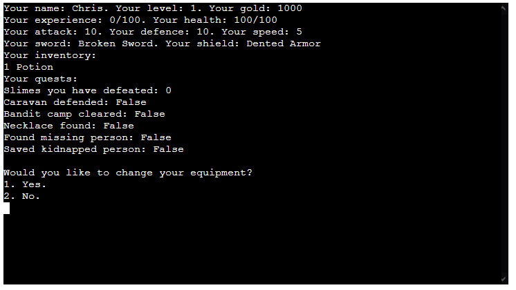

### Shop
The shop allows a user to purchase new equipment, which will be added to the players inventory. 
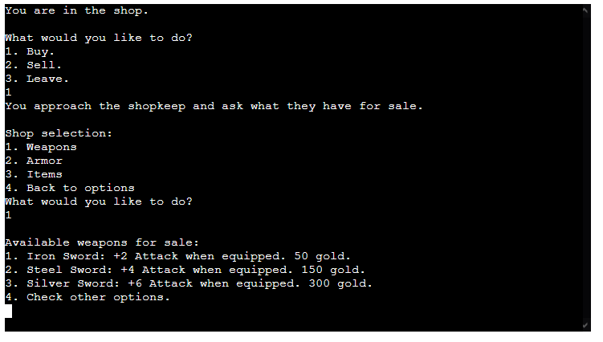

The shop also allows the player to sell equipment, should they reach a point that they no longer need that item. 
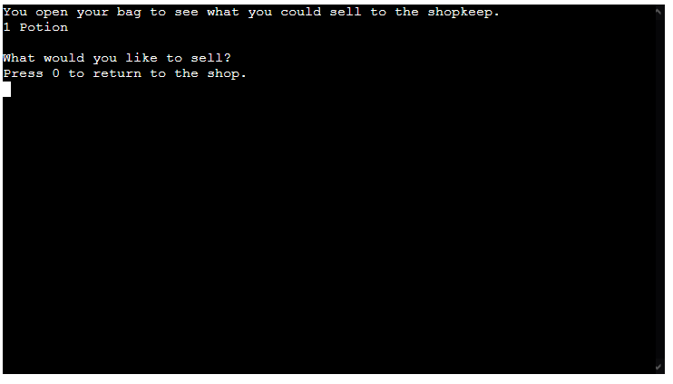

### Quests
The tavern offers players a few objectives to try and fulfill. These quests will be added to the players quest list, and can be fulfilled when adventuring. 
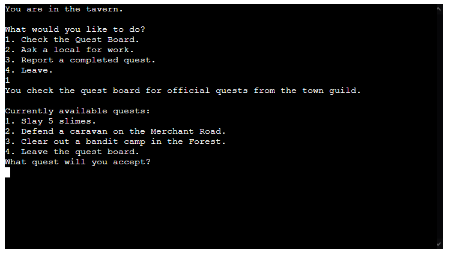

### Adventure
The town  gates prompt the player for where they wish to go. As of now there are two possible "dungeons" to tackle, or the player can return to the town centre. 
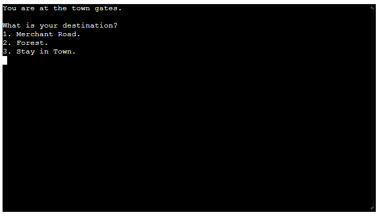

## Merchant Road
The merchant road is the simpler dungeon, consisting primarily of one "room" after the next. 
Some of these have random battles that can occur. 
Some have hidden paths the player can discover. 
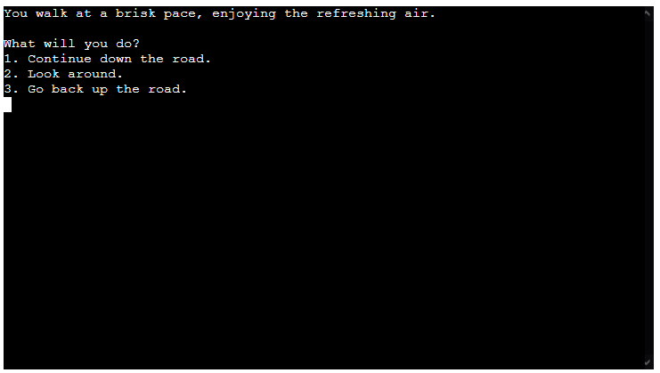

## Forest
The forest is the more complex dungeon, consisting of 3 columns of rooms that do not all connect. 
The player must move between them and try to find the way to the end, or simply return to the beginning and go back to town. 
Like the road there are some secrets that can be found by looking while in the forest. 
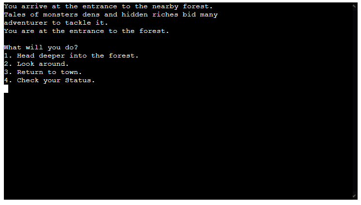

## Battles
Battles prompt the user to attack, defend, or use an item. 
Attacking will deal damage to the enemy. 
Defending will reduce incoming damage and has a chance for a critical counter attack. 
Items allow you to use potions to heal mid battle. 
A battle round always ends with the enemy attacking. 
A battle ends once the player or the enemy is defeated. 
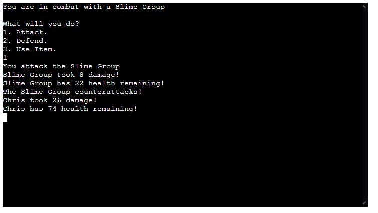

## Features Left to Implement

All features were implemented as planned, however the game could be greatly expanded on given time..
Possible future additions to the game may include:

1. Most important feature would be a helper function used to make choices, to help eliminate repeated code. 
    I feel this would be best accomplished with a function that takes in *args or *kwargs as an argument.
    As of now I am uncertain how to implement it effectively. 

2. A more randomised quest system. 
    As of now the quest system is very static. It would be nice to have quests be pulled randomly from a list and offered to the player with each visit. 

3. A more robust inventory system. 
    As of now the inventory system feels quite static. 
    Perhaps having equipment items registered as sets which the player could hold, the key being their name and a value of their stat boost?

4. More dungeons. 
    While the two implemented dungeons (Road and Forest) function well, having the option for more would help increase replayability.

5. Scaling difficulty. 
    As the player levels up or buys stronger equipment they can start to outclass enemies entirely. 
    Perhaps a system would be need to take the player's current level so as to scale the stats supplied to randomised enemies. 
    Or a difficulty scale as seen in the game flow chart that would increase enemy stats based on dungeon.

6. Greater item variety. 
    Currently the only usable items are potions to restore player health. 
    Perhaps an addition of items such as throwing knives or bombs that could damage enemies, or tonics to temporarily increase a players stats.

7. A save function. 
    Storing the player's current data to a file the player can then use to load their character after they quit the game so they do not have to start over entirely. 

# Testing

There were multiple stages of testing as the project developed. 

|TEST|PROCESS|EXPECTATION|RESULT|
|--|--|--|--|
| Printing to Terminal | What I did | What I expected | Did it work |
| Taking Input from User | Using various print statements and string interpolation | Strings and values would successfully print to terminal | SUCCESS |
| Try/Except User Input | Using Try/Except/Else statments with nested if/else statments | Error would be successfully caught and looped on to try again | SUCCESS |
| Executing Correct Code from User Input | Simple if/else statments following try/except to execute print statements and function calls | Prints and functions would execute | SUCCESS |
| Implementing slower Text | Researched how to implement the feature and tested with basic strings | Strings would print out character by character at defined speeds | SUCCESS |
| Implementing Delays | Imported the sleep function from the time module | The program would wait the specified time | SUCCESS |
| Implementing Screen Clears | Imported the os module to use the system() function | The screen would clear when called | SUCCESS |
| Creating Classes | Created basic Classes with placeholder values, printing values to screen | Class and values would create and display correctly | SUCCESS |
| Modifying Class values | Using statements to modify class values | Values would correctly update | FAILURE - updates were not kept between scripts |
| Using Class methods to modify values | Using methods within Classes to modify the values | Values would correctly update | SUCCESS |
| Battle System | Creating debug variables for Player and Enemy to fight | Battles would flow as intended | SUCCESS |
| Quest System | Full loop of accepting, completing, reporting quest | Quests would behave as expected | SUCCESS |
| Random Battles | Walking back and forth between sub-rooms | Battles would continually trigger randomly | SUCCESS |
| Equipment System | Filling Inventory with equipment to equip | Equipment would change and be added to inventory, stats would update | SUCCESS |
| Levelling System | Fight debug enemies and full loop of regular Enemies | Experience would be given, level and stats would increase as expected | SUCCESS |
| Shop System | Debug amount of gold to use to buy and sell all inventory | Items would be added and removed from inventory as expected | SUCCESS |
| Inventory System | Using items in battle | Items would work and be removed from inventory as expected | SUCCESS |
| Splitting script into multiple scripts | Sliced methods into other scripts and imported necessary ones | Code would still run as normal | FAILURE - cyclical import error |
| Creating new helper scripts | Sliced certain methods out and put them in their own scripts to be used | Code would run as intended | SUCCESS |

# Validating

## run.py
The run.py file was fully checked in the CI Python Linter and returned no errors. 

## game_slow_functions
The run.py file was fully checked in the CI Python Linter and returned no errors. 

## game_inside_travels
The game_inside_travels.py file was fully checked in the CI Python Linter and returned no errors. 

## game_outside_travels
The game_outside_travels.py file was fully checked in the CI Python Linter and returned no errors. 

## game_characters
The game_characters.py file was fully checked in the CI Python Linter and returned no errors. 
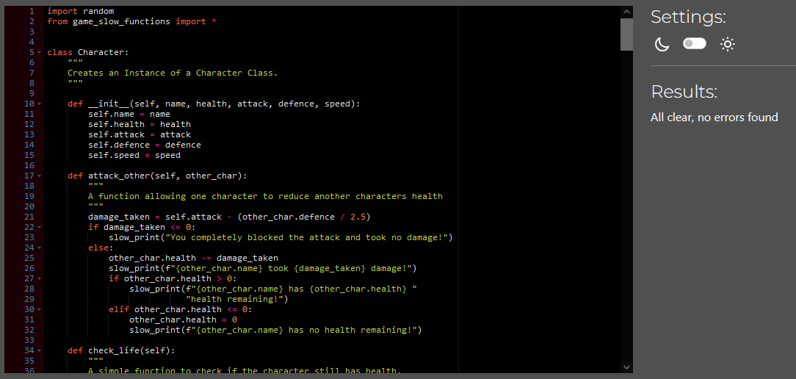

## game_intro
The game_intro.py file was fully checked in the CI Python Linter and returned no errors. 

## game_hubworld
The game_hubworld.py file was fully checked in the CI Python Linter and returned no errors. 

## game_road
The game_road.py file was fully checked in the CI Python Linter and returned no errors. 

## game_forest
The game_forest.py file was fully checked in the CI Python Linter and returned no errors. 

## game_battles
The game_battles.py file was fully checked in the CI Python Linter and returned no errors. 

# Bugs

All known bugs have been found and removed. 
Notable bugs included: 
1. Cyclical import errors. Certain scripts needed to be broken up into smaller scripts to be imported to prevent this error. 

2. Negative damage taken during battles. If defense was too high or attack was too low attacks would heal the target rather than being nullified. 

3. Empty items added to inventory list. This was an issue with the Player class not having fully updated values in its update_values() method, resulting in empty entries. 

4. Had to remove the game_over() function from both intro and battle due to cyclical import errors. Removed to prevent errors. (Perhaps a separate script for it would work?) 

5. Parsing errors not being caught correctly by try/except statements. Took all input as a string and parsed comparions using str() to prevent it.

# Deployment

This app was deployed through Heroku by being linked to the Github repository. 
In order to deply the site: 

1. I navigated to my `Dashboard` on Heroku. 
2. I selected the `New` dropdown and selected `Create new app`.  
3. I gave the app the name "Averland Adventures" and set the region to Europe. 
4. I navigated to the `Settings` tab. 
5. I added the `heroku/python` and `heroku/nodejs` to by clicking the `Add buildpack` button. 
6. I created a `Config Var` by selecting `Reveal Config Vars` and adding "Port" to the `Key` and "8000" to the `Port`. I confirmed this by selecting `Add`  
7. I navigated to the `Deploy` tab.
8. I selected `GitHub` as my deployment method.
9. I searched for and connected my repository name under the `App connected to GitHub` selection.
10. I initially deployed it manually by selecting `main` as my branch and selecting `Deploy Branch`.
11. I have since anabled `Automatic Deployments` by selecting `Enable Automatic Deploys`

The live link can be found here - 

# Credits

## Content
The code for learning how to clear the terminal was found here: 
https://www.geeksforgeeks.org/clear-screen-python/

The code for my slow_print function was found here: 
https://stackoverflow.com/questions/75486619/how-to-print-one-character-at-a-time-but-maintain-print-function-python
This is also how I learned about the time.sleep() function used for my slow_screen_clear() function

The code used to print out numbered lists was found here: 
https://stackoverflow.com/questions/29811082/how-to-print-out-a-numbered-list-in-python-3

The code for randomly selecting an item from a list was found here: 
https://stackoverflow.com/questions/306400/how-can-i-randomly-select-choose-an-item-from-a-list-get-a-random-element

The code for finding a random number in a range was found here: 
https://stackoverflow.com/questions/3996904/generate-random-integers-between-0-and-9
This has since been changed from randrange() to randint()